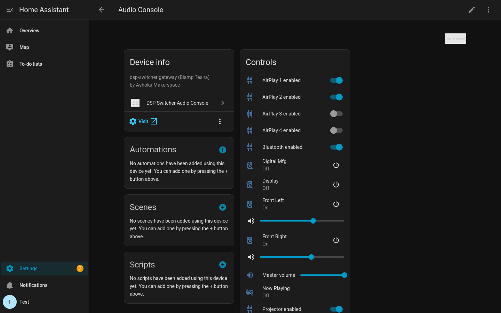
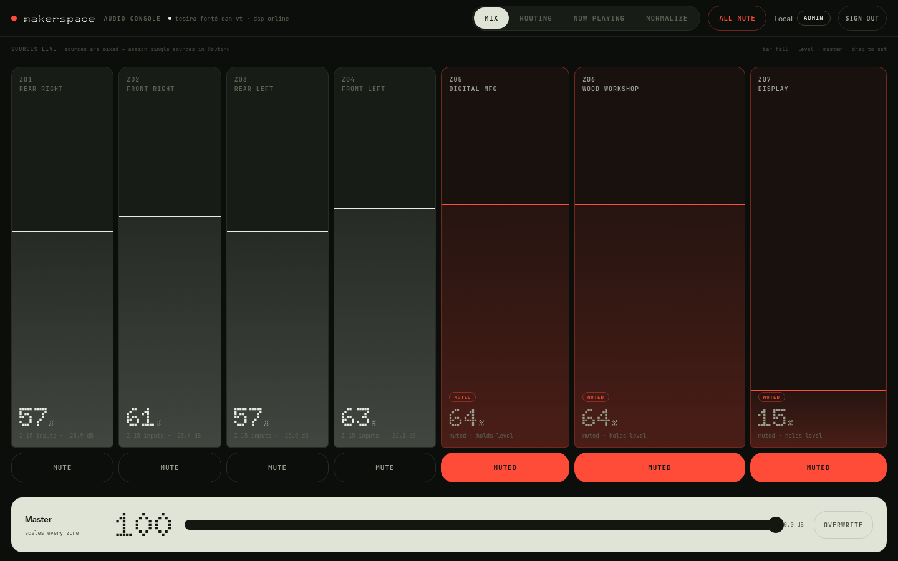
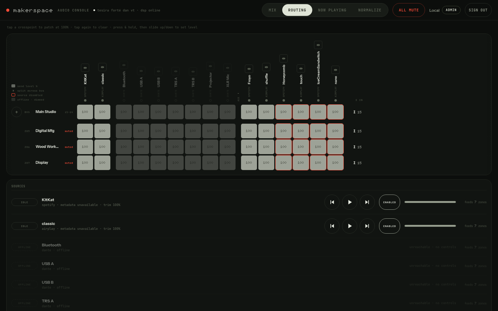
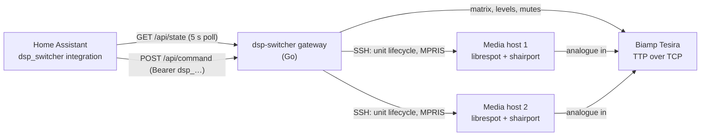

# DSP Switcher Audio Console for Home Assistant

[](https://hacs.xyz/docs/faq/custom_repositories)
[](https://github.com/saikhurana98/ha-dsp-switcher/releases)
[](https://github.com/saikhurana98/ha-dsp-switcher/actions/workflows/validate.yml)
[](LICENSE)

Bring the [dsp-switcher](https://github.com/saikhurana98/dsp-switcher) audio
console into Home Assistant. The gateway already speaks to a Biamp Tesira over
TTP and fans a handful of Spotify and AirPlay sources across a routing matrix;
this integration puts every zone on the dashboard as a media player, exposes the
master fader and per-source trims as numbers, mirrors each source's live
streaming status, and hands automations the full routing matrix through five
services. It polls one public snapshot endpoint and sends commands with a
long-lived API token — no cloud, no polling of the DSP itself.

*The Audio Console device in Home Assistant — zone media players, source enables, trims and the master fader:*



*The upstream console this integration drives — the mixing surface and the Dante-style routing matrix:*





## Architecture



## Features

- **One media player per zone** — volume, mute and exclusive source selection.
- **A "Now Playing" media player** — title, artist, album, album art and
  transport for the primary Spotify head.
- **Master fader** as a number entity, using the gateway's proportional master
  so zone balance survives a trip to zero and back.
- **Per-source trim** numbers and **per-source enable** switches. Disabling a
  source also stops its streaming unit on the media host, so it disappears from
  the network as a Spotify/AirPlay target.
- **Per-source status sensors** — `streaming` / `idle` / `offline`, with the
  advertised track metadata as attributes.
- **DSP connectivity binary sensor** so an automation can react to the gateway
  losing its TTP session.
- **Five services** covering the parts of the command surface that have no
  natural entity: individual crosspoints, send levels, the one-shot master
  overwrite, per-source transport, and a raw passthrough.
- Local polling only, with an immediate refresh after every command.

## Installation

### HACS (custom repository)

1. In Home Assistant, open **HACS → Integrations**.
2. Open the ⋮ menu → **Custom repositories**.
3. Add `https://github.com/saikhurana98/ha-dsp-switcher` with category
   **Integration**.
4. Find **DSP Switcher Audio Console** in the list, click **Download**.
5. Restart Home Assistant.

### Manual

Copy `custom_components/dsp_switcher/` into your Home Assistant
`config/custom_components/` directory and restart.

## Configuration

### 1. Mint an API token

The integration authenticates with a long-lived bearer token that carries the
**member** role. In the console UI:

**Normalize** tab (admin only) → **ACCESS TOKENS** → give it a name such as
`home-assistant`, optionally an expiry in days → **GENERATE**.

The secret (`dsp_…`) is shown **once**. The gateway stores only its SHA-256, so
a lost token is replaced, never recovered.

### 2. Add the integration

**Settings → Devices & Services → Add Integration → DSP Switcher Audio Console**.

| Field | Example | Notes |
| --- | --- | --- |
| Base URL | `https://audio.example.org` | Scheme required; trailing slashes are stripped. |
| API token | `dsp_…` | Stored in the config entry, never written to the log. |

Setup is validated with `GET /api/session` carrying the bearer. A wrong or
revoked token gives **invalid_auth**; an unreachable or non-JSON endpoint gives
**cannot_connect**.

### 3. Options

**Configure** on the integration card sets the **scan interval** (2–60 s,
default 5). The integration also requests an immediate refresh after every
command, so the interval only governs how quickly it notices changes made from
the console UI or the physical DSP.

## Entities

One device, *Audio Console*, holds everything. Unique ids are
`{entry_id}_{kind}_{key}`.

| Entity | Platform | Created for | Notes |
| --- | --- | --- | --- |
| `media_player.<zone>` | media_player | each zone in `/api/state` | Volume ↔ `volumePct`, mute ↔ `muted`, source list = every configured source, current source = the loudest active send. **State is `on` while unmuted and `off` while muted** — the console has no per-zone power, so turning a zone off mutes it and leaves the fader alone. Attributes: `output`, `volume_db`, `volume_pct`, `sends`. |
| `media_player.audio_console_now_playing` | media_player | when the gateway reports `nowPlaying` | Title / artist / album / art from the primary Spotify head. Play, pause, play/pause, next, previous. `off` when nothing is casting. Attributes: `controller`, `device`, `available`. |
| `number.audio_console_master_volume` | number | always | 0–100, step 1 → `master`. Proportional: each zone keeps its ratio. |
| `number.<source>_trim` | number | each source | 0–100 → `source/level`. Config category. Attribute: `trim_db`. |
| `switch.<source>_enabled` | switch | each source | → `source/enable`. Also starts/stops the source's unit on its media host. Attributes: `input`, `source_type`, `host`. |
| `sensor.<source>_status` | sensor | sources that report `live` | Enum `streaming` / `idle` / `offline`. Attributes: `advertised_name`, `title`, `artist`, `album`, `art_url`. |
| `binary_sensor.audio_console_dsp_connected` | binary_sensor | always | Device class `connectivity`, from `connected`. Stays available while the DSP link is down — that is the state it exists to report. |

Every other entity goes **unavailable** while `connected` is false, because the
gateway cannot act on the DSP in that state.

## Services

### `dsp_switcher.set_crosspoint`

Close or open a single matrix crosspoint.

```yaml
action: dsp_switcher.set_crosspoint
data:
  input: 5
  output: 3
  on: true
  side: l # optional: "l" or "r" for one leg of a stereo pair
```

### `dsp_switcher.set_send_level`

Set the level of one input's send into one zone. Give **either** `level_pct`
(0–100, converted) or `level_db` (raw); `level_db` wins if both are present.

```yaml
action: dsp_switcher.set_send_level
data:
  input: 5
  output: 3
  level_pct: 60
```

### `dsp_switcher.master_overwrite`

One-shot: write *every* zone to exactly this level and reset the proportional
ratios to 1. This is why there is no "overwrite mode" switch — it is an action,
not a state.

```yaml
action: dsp_switcher.master_overwrite
data:
  master: 55
```

### `dsp_switcher.source_control`

Transport on one streaming source (Spotify or AirPlay), rather than the primary
head that the Now Playing entity drives.

```yaml
action: dsp_switcher.source_control
data:
  input: 7
  action: playpause # playpause | next | previous
```

### `dsp_switcher.send_command`

**Advanced, unvalidated.** Posts an arbitrary frame to `/api/command`. Fields
are passed through untouched; the gateway is the only judge. Admin-only frames
(`channel/level`, `channel/mute`) are refused for API tokens whatever you send.

```yaml
action: dsp_switcher.send_command
data:
  type: zone/source
  payload:
    zone: 3
    source: 5
```

All five services accept an optional `entry_id` — only needed if you have more
than one gateway configured.

### Automation: duck the workshop when the doorbell rings

```yaml
automation:
  - alias: Duck workshop audio for the doorbell
    triggers:
      - trigger: state
        entity_id: binary_sensor.front_doorbell
        to: "on"
    actions:
      - variables:
          before: "{{ state_attr('media_player.workshop', 'volume_level') }}"
      - action: media_player.volume_set
        target:
          entity_id: media_player.workshop
        data:
          volume_level: 0.15
      - delay: "00:00:20"
      - action: media_player.volume_set
        target:
          entity_id: media_player.workshop
        data:
          volume_level: "{{ before }}"
```

### Automation: bring the evening source up at 18:00

```yaml
automation:
  - alias: Evening background music
    triggers:
      - trigger: time
        at: "18:00:00"
    conditions:
      - condition: state
        entity_id: binary_sensor.audio_console_dsp_connected
        state: "on"
    actions:
      - action: switch.turn_on
        target:
          entity_id: switch.spotify_enabled
      - action: media_player.select_source
        target:
          entity_id: media_player.lounge
        data:
          source: Spotify
      - action: dsp_switcher.master_overwrite
        data:
          master: 40
```

## Percentages and decibels

Every level the console exposes — zone outputs, matrix sends and input trims —
sits on the same fader range of **−60 dB … 0 dB**, and the percentage is a plain
linear position on it:

```
dB  = pct * 0.6 - 60
pct = (dB + 60) / 0.6
```

So 0 % is −60 dB, 50 % is −30 dB and 100 % is 0 dB. Both directions clamp. The
`/api/state` snapshot reports `volumePct`/`trimPct` already converted, while
every command frame takes raw dB — the integration converts on the way out, and
`set_send_level` lets you pick either unit.

## Troubleshooting

**A repair notice says re-authentication is required, or entities went
unavailable with a 401.** The token was revoked or expired. Mint a fresh one
(Normalize → ACCESS TOKENS → GENERATE) and paste it into the reauth prompt on
the integration card; the base URL is kept.

**`cannot_connect` during setup.** Check the base URL includes the scheme and
resolves from the Home Assistant host, and that nothing in front of the gateway
strips the `Authorization` header.

**Everything is unavailable but `DSP connected` is `off`.** The gateway is up
but has lost its TTP session with the Tesira. Nothing the integration sends will
land until it reconnects.

**A service call fails with "admin role required".** API tokens carry the member
role only, by design. Output normalization and token management stay human-only
in the console UI.

**Slow to reflect changes made in the console UI.** The integration polls; drop
the scan interval in the options flow. Commands sent from Home Assistant refresh
immediately regardless.

## Development

```sh
python -m venv .venv && . .venv/bin/activate
pip install pytest aiohttp
python -m pytest
```

`custom_components/dsp_switcher/api.py` and `const.py` import nothing from Home
Assistant on purpose, so the client and the percentage/decibel maths are
testable with nothing more than `pytest` and `aiohttp`. The CI workflow also
runs `hassfest` and the HACS action on every push, pull request and weekly.

## License

MIT — see [LICENSE](LICENSE).
